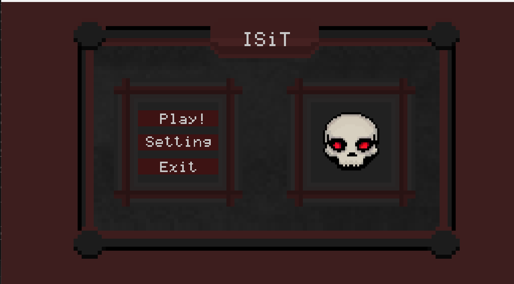
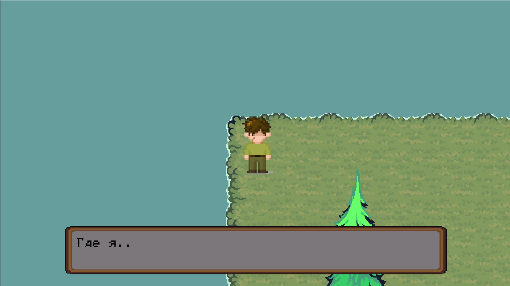
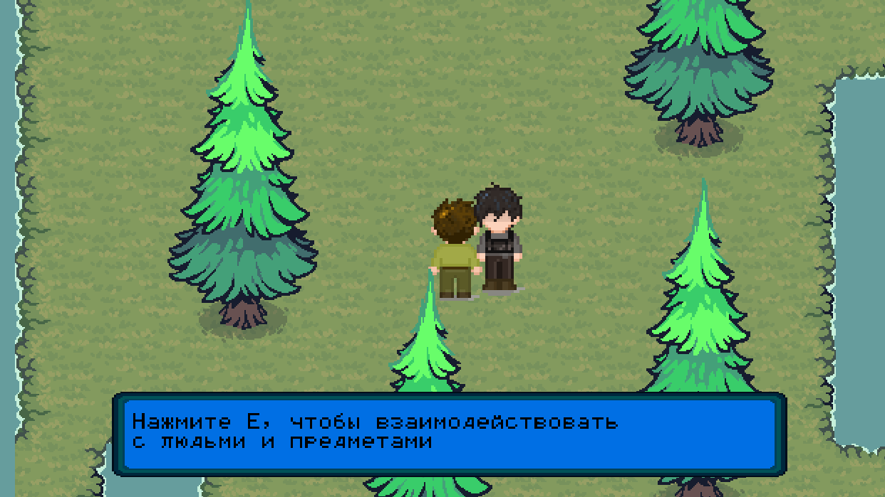

# RPG на С++/raylib

## Описание
2D RPG-игра, написанная на C++ с использованием raylib.  
На данный момент реализовано главное меню, перемещение персонажа и взаимодействие с NPC через диалоги.  
Проект находится в стадии разработки.

## Возможности
- Передвижение персонажа
- "Дыхание" персонажа в момент бездействия
- Система диалогов
- NPC
- Загрузка данных из JSON

## Технологии
- C++17
- raylib
- nlohmann/json

## Управление
- WASD - движение 
- E - взаимодействие

## Скриншоты

## Как запустить

### Windows
1. Установить raylib
2. Открыть `.sln`
3. Собрать проект

## Структура
- src/ - исходный код
- assets/ - ресурсы
- data/ - JSON/.csv
- include/ - заголовочные файлы

## Планы
- Добавить большую карту
- Реализовать систему коллизий
- Добавить взаимодействие с предметами
- Расширить систему NPC и диалогов
- Добавить сюжет
- Улучшить визуальную часть